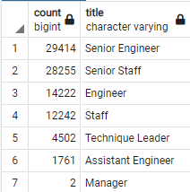
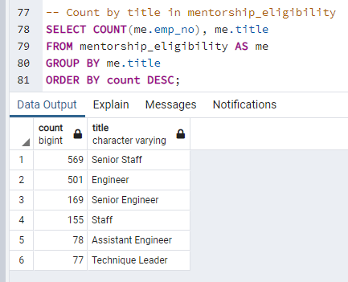
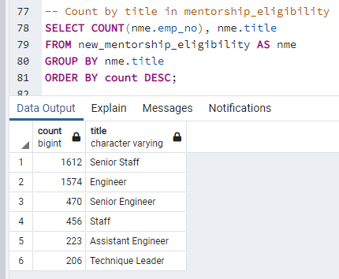

# Pewlett-Hackard-Analysis

## Overview of the analysis:
Pewlett_Hackard hired me to help their HR Analyst Bobby create a database. Retirement packages will be offered to employees who meet specific criteria. This analysis assists the company by using SQL to query data from 6 CSV files to make sure the data is clean and accurate.

## Results:

### Deliverable 1: # of Retiring Employees by Title

- In the Data folder there are 3 csv created for this deliverable.
	1. *retirement_titles.csv* was created to find which employees were born in right time frame for retirement, but this list has multiples because it includes all titles a person has had within the company.
	2. *unique_titles.csv* aims to fix the issue with the previous table by filtering the list to include only the last title an employee had at the company.
	3. *retiring_titles.csv* counts how many employees from each job title are retiring and thus creates a short list of which positions need to be filled in the near future.

### Deliverable 2: Employees Eligible for the Mentorship Program

- In the Data folder 1 csv was created for this deliverable. 
	1. *mentorship_eligibility.csv* find current employees eligible for retirement because of their age. 

## Summary:

Something important to note is that while *unique_titles.csv* found 90,398 employees about to retire, *mentorship_eligibility.csv* finds that only 1,549 of those are eligible for the mentorship program if they choose to join. This means that if EVERY eligible employee agrees to stay as part of the membership program each mentor would have 58 mentees. There are not enough eligible mentors, which is why I propose the following solution:


The current eligibility for a mentor hinges on the birthdate being between Jan 1, 1965 and Dec 31, 1965. By allowing employees born just 2 months earlier on Nov 3, 1964 to join, the group the number of eligible mentors increases from 1,549 to 4,541 allowing for the mentor to mentee ratio to smooth out to 1:20. The query below return the employees eligible under the new conditions.
```
SELECT DISTINCT ON (e.emp_no) e.emp_no, 
	e.first_name, 
	e.last_name, 
	e.birth_date,
	de.from_date,
	de.to_date,
	ti.title
FROM employees AS e
INNER JOIN dept_emp AS de
ON (e.emp_no = de.emp_no)
LEFT JOIN titles as ti
ON (e.emp_no = ti.emp_no)
WHERE (de.to_date = '9999-01-01') AND 
	(e.birth_date BETWEEN '1964-11-03' AND '1965-12-31')
ORDER BY e.emp_no;
```
______________________________________________________________________________________
For reference, these are the positions that need filling:



This need for this solution is even more evident when we see what the count was for the eligible mentors was before and after those 2 months were added. Below are images that include the code for the queries and the results in tables.





